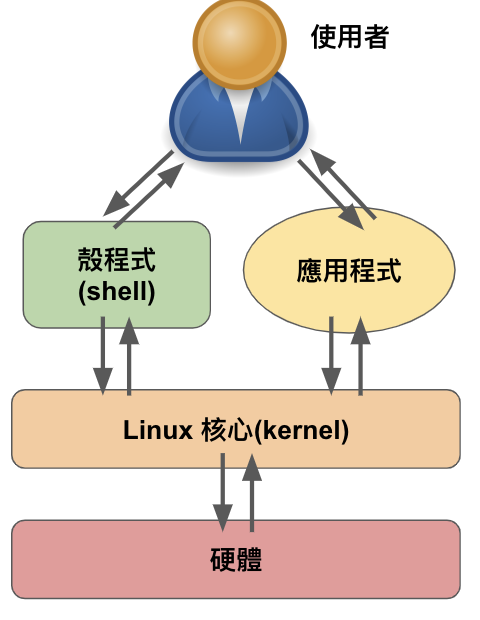

# unix系統

## Linux

- 開發者：Linux Toravalds
- 免費自由開放的軟體
- 允許多人/多工處理環境：允許多使用者同時登入使用，良好資源分配
- 安全性與穩定度高：嚴格權限控管，穩定套件更新
- 高度的可攜性與擴充性：
  - 大型工作站
  - 個人電腦
  - 嵌入式系統

系統架構= 核心(Kernel)＋殼程式(shell)



我們可以透過應用程式（Application） or 殼程式(shell)，去和核心(Kernel)溝通，然後Kernel就會去與硬體溝通。

常見的發行版本：CentOS, Debian, Fedora , Gentoo, UBUNTU等

### UBUNTU


虛擬機是什麼
- 一種可以用模擬硬體（如電腦）的軟體應用程式
- 可以分為
  - 程序虛擬機器：Flash player
  - 系統虛擬機器：Virtual Box

### 分割區

linux系統適用「資料夾」的概念來進行硬碟分割，比如`/`是使用分割區sda1，`/hone`使用分割區sda2


### 指定

```shell
sudo -s // 切換到superuser do，之後sudo指令就不用再輸入密碼
exit // 離開
ls -a // 可以看帶點的檔案
ls -l // use a long listing format以長格式表示，包含檔案屬性。
sudo apt-get update // 更新
sudo apt-get update sl // 更新「sl」套件
sudo apt-get remove sl // 刪除「sl」套件
ping 8.8.8.8 // 連到ip
host google.com //做名稱解析
```

```
control+l  // 把shell指令清掉
command+shift+t //重開關掉視窗 (for瀏覽器)
```