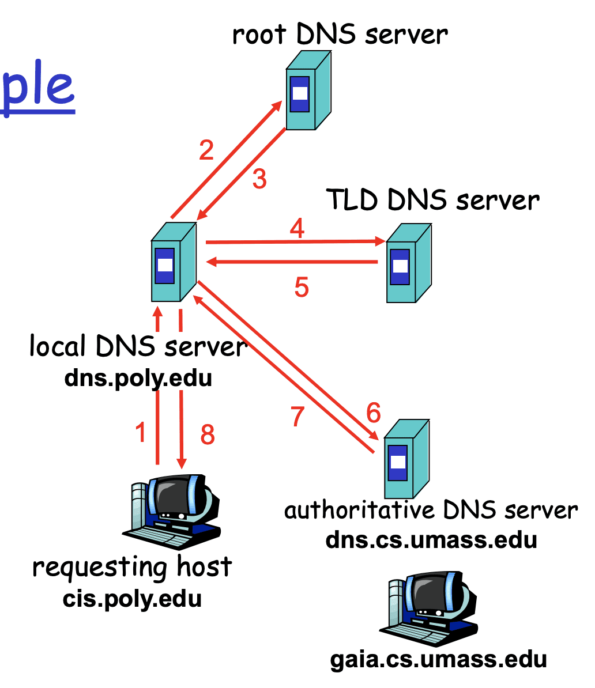

# DNS（Domain Name System）

當我們按下yahoo.com.tw時，因為電腦不認識yahoo.com.tw，所以需要有人告訴我們yahoo.com.tw的IP是什麼，而DNS就是那個可以幫助我們查詢name和IP對應關係的機器。然而，並不是一台機器就儲存所有的對照表。DNS是擁有階層架構（hierarchy）的，透過不同階層的分流，最後才會找到對應的IP。DNS可以分為以下階層：

1. Root DNS Servers：把query轉到 com, org, net, edu 的DNS server上
2. TLD Servers(Top-level domain)：把query轉到個別的Authoritative上
3. Authoritative DNS servers：負責提供真正hostname和IP的對應

舉例來說，當使用者想去尋找 amazon.com 的時候，它會先把query發到local DNS server(每個ISP基本上都會有一個local DNS server），然後它
- 會去 root server 去找 com DNS server在哪
- 會去 com DNS server 去找amazon.com DNS server在哪
- 會去 amazon.com DNS server 去找到www.amazon.com 的IP是什麼

## 不同Query的路徑

- iterated query:

- recursive query

問題
- 這兩種路徑怎麼決定的、有什麼好處、市佔率多少？