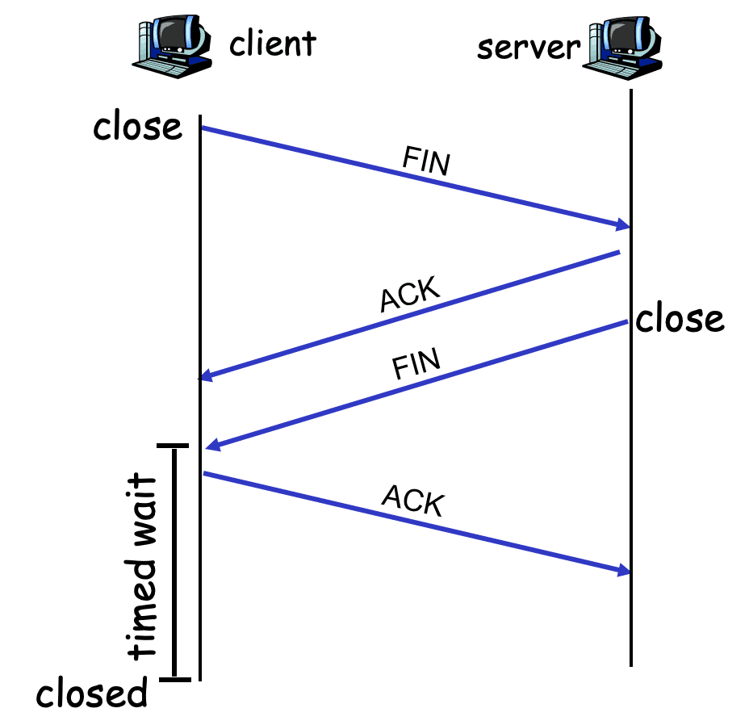
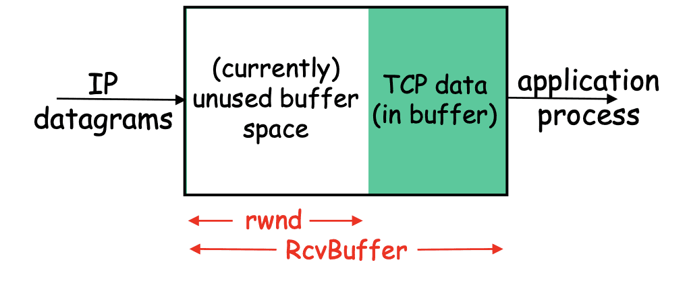
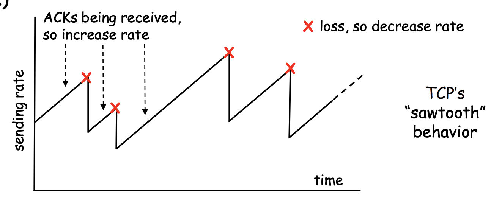

# RDT 可靠資料傳輸(Reliable Data Transfer)

在理想的TCP模型中，我們會假設訊息在網路上會安全的運送。但現實並非如此，傳輸協定的下層是「不可靠」，可能存在著許多像是錯誤、封包遺失等等狀況，因此這時候，我們就必須在傳輸層自行設計一些溝通模型，來確保sender和receiver的溝通是正確的，如果正確要讓sender送下一個檔案，如果錯誤要讓sender重送檔案。而這樣的溝通模型就稱為「可靠資料傳輸(Reliable Data Transfer)」。通常狀況下，RDT的模型是用FSM(Finite State Machine 有限狀態機)來定義狀態與操作方式。

## rdt1.0

主要有傳輸端與接收端兩個部分，資料傳輸方式很單純，傳輸端等待上層傳資料進來，收到上面的資料

以後裝成封包送出去。
接收端收到封包以後，將封包解開，把訊息往上送。

## rdt2.0

sender會送封包到receiver

- 當receiver收到資料，會回傳一個ACK（表示Acknowledgement），這時候sender就知道對方有收到了。
- 當reveiver收到錯誤的資料，會回傳一個NAK（Negative-Acknowledgment），這時候sender就知道要再送一個。
- 當reveiver沒有收到資料（rdt2.0 沒有機制處理這個狀況）
- 當receiver收到資料，會回傳一個ACK（表示Acknowledgement），但是沒有送到（rdt2.0 沒有機制處理這個狀況）
- 當receiver收到資料，會回傳一個NAK（Negative-Acknowledgment），但是沒有送到（rdt2.0 沒有機制處理這個狀況）
- 當receiver收到資料，會回傳一個ACK（表示Acknowledgement）和checksum，但是壞掉了
- 當receiver收到資料，會回傳一個NAK（Negative-Acknowledgment）和checksum，，但是壞掉了

息，當資料接收到以後確認無誤，會送ACK給來源已確定資料無誤。當偵測到錯誤時 會傳回NAK通知來源

端再送一次。

## rdt2.1

改版：在2.1版中新增了sequence number去確定是否傳遞了一樣的封包

同樣使用ACK與NAK來確認訊息，封包的號碼可以用來確認是否重新傳輸封

包。
例如接收端在等待編號0的封包，結果收到封包1，此時會回傳ACK1給來源端，而正在等候ACK0的來源端

收到ACK1 表示封包0可能遺失，所以會再重送封包0。

## rdt2.2

改版：在2.2版中，取消NAK，直接用把ACK加上一個bit的sequence number去表示ACK和NAK
- ACK 0 表示 ACK
- ACK 1 表示 NAK

## rdt3.0

改版：在3.0版中，sender增加了timer，去處理資料不見的問題。TCP會根據前一次的運送狀況，去稍微統計下一次timer應該設定多長。

sender會送package0到receiver
- 當receiver收到資料，會回傳一個ACK0，這時候sender就知道對方有收到了，然後它再送package 1 到receiver（0和1交替）...
- 當reveiver收到錯誤的資料，會回傳一個ACK1，這時候sender就知道要再送一個。
- 當receiver收到資料，但sender以為沒收到，它就在重送package 0 ，之後sender接續收到兩個ACK0，他就把重複的ACK丟掉了。
- 當reveiver沒有收到資料，sender等了一下發現沒有回應，它就在重送package 1（如果超過default 7次就不送了）
- 當receiver收到資料，會回傳一個ACK0，Sender如果等了一個合理的時間，但是沒有收到東西，就會重送package0，receiver檢查了sequence number知道這是重複的，所以就就把它丟掉，並且再回一個ACK0。
- 當receiver收到資料，會回傳一個ACK1，Sender如果等了一個合理的時間，但是沒有收到東西，就會重送package0。
- 當receiver收到資料，會回傳一個ACK0和checksum，但是壞掉了
- 當receiver收到資料，會回傳一個ACK1和checksum，，但是壞掉了

random lost：隨機遺失，不知道為什麼就消失
congestion lost：堵塞遺失，網路塞爆，送100次都送不到

## Pipelining Protocols 是什麼？

實際的情況下並不是
sender送出package -> sender等待receiver的ACK ->sender再送出下一個package
因為這樣中間會有很多等待時間

實際的情況下比較像是
sender連續送出一堆package -> receiver如果確認收到package就連續送出一堆ACK ->sender連續收到一堆ACK

那這就稱為`Pipelining Protocols`

### Pipelining Protocols 的類型

1. Selective Repeat：

- 假設sender送出1~10的package，而receiver只缺少9，那他就發一個NAK去sender讓他把9送過來。那這樣的好處就是，他可以只去拿需要的資料，而不需要一次讓sender送很多。但缺點就是，他必須有buffer去把1~8和10放好，然後管理當中的順序問題。（TCP應該是利用cumulative ACK走這個方式）

2. Go-back-N：

- 假設sender送出1~10的package，而receiver只缺少9，那他就發一個NAK(9)去sender讓他把9~9+N送過來。那這樣的好處就是，可以照順序去收，不需要buffer去把1~8和10放好，但壞處可能就是sender需要常常送重複的內容。

    - sender：sender一次送出0~N個package到receiver那邊，receiver收到後就會告訴sender所謂的cumulative ACK。假設是5好了，那就表示receiver收到了1~5的package對方都收到了。那sender就會送6~6+N個package。那假設0的timer過期了，那sender就會重新送0~N個package。
    - receiver：當receiver收過0了，他會預期他要收到1的package，如果沒有（像是收到5)，那他就會把5丟掉，然後一直回0的ACK到sender那邊，讓sender把1~1+N送過來。

# TCP

## TCP connection Managemrnt

sender和receiver在真的傳遞封包之前，會先交換一些訊息，告訴sender自己有多少buffer，因此傳輸速度要多快。

handshake的步驟

1. Step1：client送TCP SYN去server那邊
    - 確定server initial seq. #
2. Step2：server收SYN然後回SYNACK。
    - server會重整一個buffer
    - 確定server initial seq. #
3. Step3：cient收到SYNACK，會回覆ACK

### 關閉連線 Closing connection 

當要關閉連線時

- client送FIN（表示Finish），表示自己不會再送資料，然後server收到就會回ACK，然後執行clientSocket.close()。
- server送FIN（表示Finish），表示自己也不會再送資料，然後client收到就會回ACK。但是server假設一直沒有收到ACK，server就會以為client還在連線，於是他自己就會保留這個連線。但是如果時間過了很久，server測試時都發現對方沒有回應，他就會關閉連線。

#### cumulative ACK 和 duplicate ACK

在TCP的運輸中，會使用cumulative ACK 和 duplicate ACK 來管理訊息傳遞。

- cumulative ACK：當receiver收到1時，他會回ACK1，當他收到2時，會回ACk2（表示1~2都收到了），當收到ACK3（表示1~3都收到了）
- duplicate ACK：當receiver看到有gap的時候，就會送duplicate ACK給sender。我猜是收到1,2,5，receiver看到沒有3,4有一個gap，就會送duplicate ACK。sender收到duplicate ACK就知道receiver收到後面的內容，但前有一個segment他沒收到。這時候sender就趕快補送。

例子：

假設 sender 連續送 1,2,3,4,5 給 receiver。當receiver收到1時，他就會回ACK1，表示收到1了。當收reveiver收到2時，就回ACK2，表示收到1~2了。沒想到封包3在路上掉了，來的是4，這時候reveiver知道這個4是out of order的封包，於是receiver就會把它放在buffer，然後再送ACK2一次，表示我只收到了1~2。這時候封包5又來了，receiver又把它放在buffer中，然後又再送了ACK2。這時候sender發現了自己收到3個ACK2，sender就知道是因為receiver沒有收到3，所以才一直回它ACK2，這時候它就會補送3給receiver。而當receiver收到後，因為它1~5都到齊了，它就會直接送ACK5給sender，表示他這邊已經有1~5封包了。

#### TCP - flow control

當資料進來時，就會把封包放到buffer，然後讓application去讀取。但是如果資料多於buffer，資料就必須丟掉。因此receiver會告訴sender自己剩下多少buffer，請對方控制一下傳輸速度。

- rcvBuffer：所有的Buffer有多大
- rwnd：還沒用到的buffer

#### TCP - congestion control

當網路上，當有太多的人同時擁有太多資料要運送，但由於router數量和能量有限，就會導致網路很壅塞。

- `end-end congestion control`（目前最常見的做法）：讓sender自己偵測網路是否有壅塞的狀況。sender如果都可以順利收到ACK，就表示網路還不錯，就可以繼續增加速度。但是如果發現太多運輸的資料都沒送到，那就減少速度。
    - 遇到timeout時：ACK一直沒有回來，把cwnd減少到1。
    - 連續收到3個duplicate ACKS：一直遇到duplicate ACKS，表示中間有一些資料掉了，可能也是因為網路壅塞導致，把cwnd減少到一半。

- `network-assisted congestion control`（理想的做法）：讓router可以回報說自己收到太多封包了。

> 但是UDP就完全不會管congestion control，會一直把資料送出去。

TCP - congestion control 的方法

- slowstart phase：一開始送的比較慢，然後再慢慢增加。遇到congestion，就快速減少。

