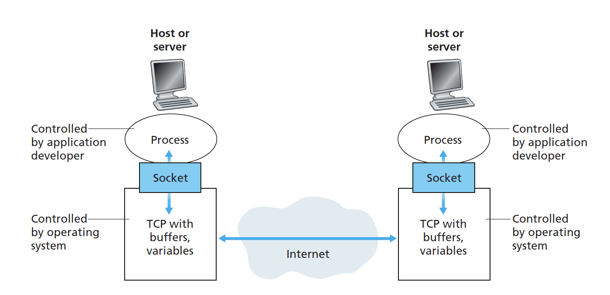
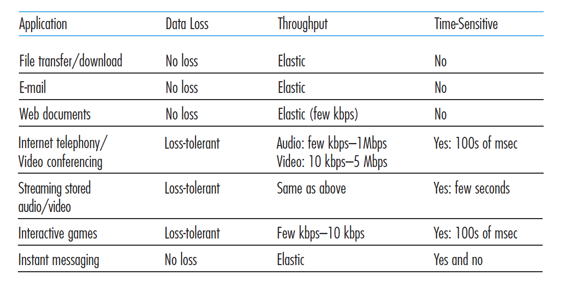

# 網路架構（Network Architecture）

目前常見的網路架構是「TCP/IP模型」，它將網路分為了 5 層（原本OSI模型中有七層），其時就是5個模組的內容。

- application layer（吸收了原本的有presentation和seesion層）
- transport layer：決定怎麼傳東西
- network layer：可以決定傳輸方向
- link layer：處理如何把router連再一起，還有錯誤可以怎麼檢查的問題
- pysical layer：主要偏訊號處理和硬體的問題

Encapsulation：訊息每經過一層，該層就會在header上面增加一個message，然後到達別人的對應層時，該層就會檢查對應的message，並拿掉該message。

> Network Architecture 和 Application Architecture 的不同 : Network Architecture是指網路的五層結構，是已經規定好的；但是 Application Architecture 是 應用程式自己的結構，完全由開發者決定。

## 什麼是分層？為什麼要有層？

分層有點像是機場的各個關卡

買票->行李check in ->進海關->上飛機->搭飛機->下飛機->出海關->拿行李->拿票去抱怨（？），其中，買票/拿票去抱怨、放行李/拿行李、進海關/出海關、上飛機/下飛機 就是一個機場的「同一層」。分層的好處就是開發者可以只專注在自己層次的事情，然後裡用別層的服務系好。

## 1. 應用層（Application layer）

應用層（Application layer）是應用程式（application）存在的層。當應用程式要傳遞訊息時，它會把這些內容變成packet並且請transport layer運送。在應用層中，開發者可以決定的事情就只有應用程式的架構，還有傳遞時要使用什麼Protocols。因此開發者可以不需要寫Network core的程式，只要管好應用層就好。

### 程序溝通（Process Commumicating)

程序(Process)的定義是是「`跑在系統上的程式`」，當不同的程序在同一個機器上時，他們透過OS(operating system)的規則彼此溝通。而不同的機器的程序也可以透過網路的方式彼此溝通。
大部分的應用程式（Application）會擁有一對溝通程序（Commumicating Process)，一個負責把訊息傳出去，一個負責把訊息收進來，然後這些程序s會透過socket把訊息傳出去、收進來。

> 程序像是房子，然後Socket像是門。當程序想要把訊息送出去的時候，他會透過Socket把訊息送到外面。

## 應用程式間的常見關係

### 1-1. 客戶端與伺服器端架構（Client-Server Architecture）

客戶端（Client）會自己主動去尋找伺服器（Server）的方式下載檔案，而不是伺服器（Server）主動去找客戶端（Client）。

伺服器特性
- 伺服器永遠是啟動的
- IP位置必須是永遠不變的，不然大家找不到它

> 通常一個伺服器很難去處理所有的request，所以大公司通常會有自己的資料中心(data center)去放許多的上百個主機（伺服器），來去處理多個需求。例如：Google就有30-50的資料中心。

客戶端特性
- 不需要永遠開起
- 可能使用動態的IP

常見使用Client-Server的服務包括Web, FTP, Telent 和 E-mail

> 客戶端的定義是「主動發起溝通的程序」，而伺服器端的定義是「被動等待聯繫的程序」

### 1-2. 純P2P架構（Pure P2P Architecture）

只要一個host把檔案下載下來，之後就可以把檔案與其他的host互相傳播。在以前，server的內容都需要付費，因此流行P2P。但是在現在，許多內容提供商改用廣告付費的商業模式，從server下載檔案變得更加容易。（例如：foxy、Skype都是屬於P2P架構）

特性：
- 可以不用永遠開啟
- IP位置可能會變動

以BitTorrent為例：BitTorrent是之前流行的P2P軟體，「下載方」會得到誰有檔案的列表，然後去向那些人要求下載一部分的檔案。而「提供方」只會把檔案給曾經給那些曾提供檔案的前4名，所以如果有人不提供檔案，那他就會下載的比較慢。

### 1-3. 客戶端/伺服器和P2P混合架構

Skype是一種混合架構，在通話之前是Client-Serve架構，但通話時是P2P架構。

- Skype在確認身份時會使用Client-Serve架構，讓server確定雙方身份，但是一但通話後，為了保持通話順暢，當通話時就使用P2P架構。（Skype使用的protocol是非公開的，所以大家不太能做跟他一樣的東西）

- Wechat和line可能也是Hybird架構，但也有可能不是，因此通話時還是有經過Server，所以紀錄通話訊息。

## 應用層常見協議

- HTTP
- FTP
- SMTP
- DNS

## FTP

FTP是以前傳遞檔案的方式，但現在有了雲端之後，就多以HTTP解決問題。FTP server 就像一個檔案資料夾需要帳號密碼進入才可以存取裡面的檔案
作檔案搬移、複製、下載、上傳。

## HTTP 

HTTP: Hyper text transfer protocol 

HTTP是一種基於TCP的協議，他的特色是

- 資料穩定（data reliable）
- 傳資料前要先建立起TCP連線，然後client再發送request
- HTTP使用電腦的80 port（port是讓人傳送者知道資料要送到哪個application的編號） HTTPS用443 / FTP用21
- 無狀態（stateless）：不會去紀錄曾經傳遞過什麼資料

>HTTP 1.0 和 HTTP 1.1的差異： HTTP 1.1 多 POST 和Delete

### HTTP連線方式 

1. Nonpersistent connection：每一次傳物件的時候，就會開啟一個TCP連線。但缺點是，如果要傳很多的物件就要開啟很多個TCP連線。但現在瀏覽器，能夠提供「平行」的運作，一次開啟10個TCP連線，然後傳10個資料。
2. persistent connection：一直保持TCP connection，然後一直傳物件。

### HTTP結構

- HTTP的訊息使用ASCII（所以看得懂）

- GET   (方法)
- HOST （要連接的地方）
- User-Agent:  （表示使用的瀏覽器類型）
- Connection:Close （表示傳送完就會關閉TCP連線）
- Accept Type 

### 上傳的方法

- POST method：透過entity body把資料傳出去
- URL method：把資料放URL，用get的方式傳送

### Cookie

HTTP基本上一是一個無狀態的協議，但是實際上現在的Server都透過Cookie記錄了許多東西。
- Cookie是一個在瀏覽器上面的檔案，會送到伺服器。
- 後端的response說set cookie，前端下次就會把cookie戴上去。

## 2. 傳輸層（Transport layer）

傳輸層就像是傳輸層的郵局，他提供不同「運送服務（協議）」給上層的應用層使用，而上層的開發者可以自己決定想要什麼服務。

- network layer: 把檔案透過ip傳到正確的host
- transport layer: 把檔案透過port傳到正確的socket，然後送到processes

### 傳輸層的特性

好的傳輸層希望可以在以下需求層面滿足需求
- 避免資料遺失（data loss）：不要有太多資料遺失，舉例來說：影片傳遞可以容忍一些資料遺失，但傳檔案、訊息不行。
- 速度要快（timeing）：一個bit從送出的socket到接收的socket的時間可以愈快愈好。舉例來說：如果是傳訊息可以容忍一些延遲，但如果是電玩、物聯網、自動駕駛不行。
- 擁有一定的吞吐量（Throughput）：固定時間可以運送一定的bit出去
- 保證安全性（Secuirty）：具有一定安全性，但基本上TCP、UDP都無法安全性保證

### 2-0 傳輸動作

- multiplexing：把資料解析，然後把資料送到正確的socket
- demultiplexing：把資料包裝起來，貼上正確的IP、Port位置，然後送出去

### 2-1 TCP協議

TCP是最常見的運送服務，它的特性是
  - 不會有資料遺失（data loss）：可以穩定傳遞資料，而不會有資料遺失。TCP會複製一份，因此如果對方沒有收到，TCP會再送一次
  - 順序傳送（order deliver）：因為封包的先後順序是不一定的，所以當TCP收到資料後，會先確保順序是正確的，然後再送給application layer
  - 無法保證安全性：TCP不提供加密的服務
  - 流量控制（congestion control）：當TCP發現外面網路壅塞的時候，就把貼心的把資料少送出去一點（UDP不管外面塞不塞，照樣送出去）
  - 吞吐控制(flow control)：如果送來的資料賴多，會先放到接收緩衝區 (Receiving Buffers)，慢慢消化

透過

> 對於安全性問題，可以使用SSL（Secure Socket Layer），它會跑在應用層上，先把資料加密然後再把資料傳給TCP socket，再讓TCP去傳送資料。而只有使用SSL加密的網站，才能得到HTTPS的認證。

### 2-2 UDP協議

UDP協議是少見的運送服務，應該只有5-10%市佔率，它的特性是
  - 資料不一定可以傳到
  - 不會把資料按照順序傳送
  - 沒有流量控制（congestion control）和流量控制（congestion control）：不會降速，不管別人有沒有拿到，會一直把資料丟丟丟，也不會控制收到的資料量
  - 無法暴政安全性：UDP也不提供加密服務

常見案例

- DNS：因為TCP解析比較複雜，用UDP的反應比較快。
- SNMP：用來檢查網路狀況是否ok，
- Streaming：像是即時戰況轉播，如果不介意丟掉一兩個封包（因為會一直傳）的應用，也可以用UDP。（如果Application需要「按順序排列」或是做其他事情，需要自己做，UDP不會幫忙。）

# 電腦的歷史

- 1961 Packet-Switching 被 Kleinrock 證明是理論
- 1964 軍隊網路
- 1967 被申請為研究計畫
- 1972 第一次公開Demo
- 1972-1980 Vint Cerf & Bob Kahn 一起設計network core的結構

#### network core 設計原則
  - router 用最少力氣傳送資料，內部不會有大改動
  - 不保證傳遞資訊
  - stateless 無狀態，不會記憶傳送的東西
  - 不用中心的server去控制

- 1980-1990 有約10萬的host連到network core
- 1983 有人開發出TCP/IP的技術
- 1990 Web出現有一些 hypetertext html技術
- 1990-2000 出現app, p2p