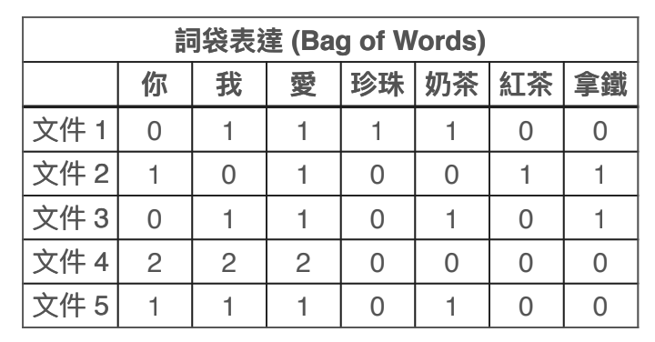
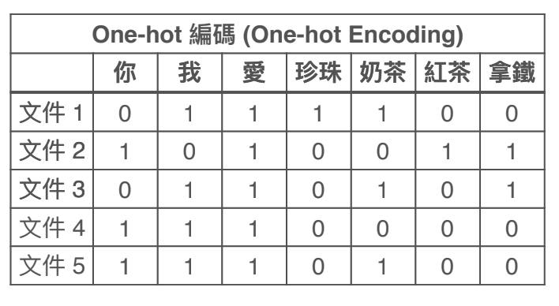

# 關鍵字萃取

- TFIDF
- 共現與圖模型

## 如何把文章轉成量化的矩正？

1. 首先要先把詞切好，讓這些詞代表N個向量

文件 1:我愛珍珠奶茶
文件 2:你愛紅茶拿鐵
文件 3:我愛奶茶與拿鐵
文件 4:你愛我,我愛你
文件 5:你我愛奶茶

分成：我 / 愛 / 珍珠 ／奶茶 / 拿鐵 /你 /紅茶 七個向量

2. 再選擇編碼方式，把文章轉換成向量

- `詞袋表達`：根據詞出現的頻率，轉換成向量。

文件4:「你愛我,我愛你」就會是 2,2,2,0,0,0,0

- `one-hot-encoding編碼`：根據詞是否出現，出現就標示1，不出現就標示0，藉此轉換成向量。

文件4:「你愛我,我愛你」就會是 1,1,1,0,0,0,0

## 如何利用「高頻」找出關鍵字？

可以使用tf-idf演算法，來判斷「一個詞對於文章的重要性」（是否為關鍵字）

決定一個詞彙是否是該文章關鍵字，必須滿足：
- `tf`（詞彙出現的頻率）要高，例如：資料分析
- `idf`（在不同文件出現的頻率）要低，因為太高表示他很通俗，例如：我覺得、他

從該例子可以看到
- 文件一的關鍵字是珍珠、紅茶、拿鐵
- 文件二的關鍵字是拿鐵

## 如何利用「連結」找出關鍵字？

可以使用透過詞彙與詞彙之間的關係，來判斷哪些詞最重要。

1.  RAKE（共現與圖模型）：

決定一個詞彙為關鍵字，必須滿足：
- 該詞彙的維度（Degree）跟其他詞的連結愈高，愈表示他是關鍵字
- 該詞彙的頻率（Frequency）在所有文章中出現的頻率要低，因為太高表示他很通俗，例如：我覺得、他

2. Text Rank：可以找出不同詞彙的「橋樑」
