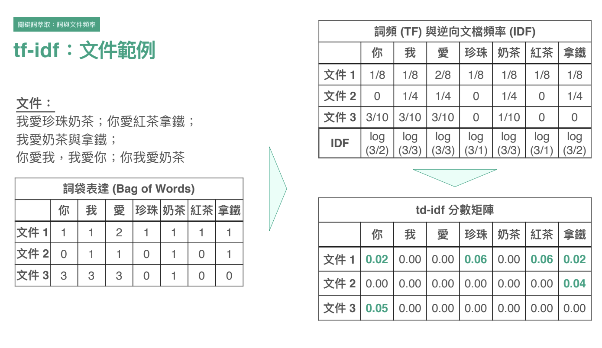

# 文章關鍵字分析（含Python程式碼）

- TFIDF
- 共現與圖模型

## 如何把文章轉成量化的矩正？


1. 首先要先把詞切好，讓這些詞代表N個向量

文件 1:我愛珍珠奶茶
文件 2:你愛紅茶拿鐵
文件 3:我愛奶茶與拿鐵
文件 4:你愛我,我愛你
文件 5:你我愛奶茶

分成：我 / 愛 / 珍珠 ／奶茶 / 拿鐵 /你 /紅茶 七個向量

2. 再選擇編碼方式，把文章轉換成向量

- `詞袋表達`：根據詞出現的頻率，轉換成向量。

文件4:「你愛我,我愛你」就會是 2,2,2,0,0,0,0


- `one-hot-encoding編碼`：根據詞是否出現，出現就標示1，不出現就標示0，藉此轉換成向量。

文件4:「你愛我,我愛你」就會是 1,1,1,0,0,0,0


## 如何利用「高頻」找出關鍵字？

可以使用tf-idf演算法，來判斷「一個詞對於文章的重要性」（是否為關鍵字）

決定一個詞彙是否是該文章關鍵字，必須滿足：
- `tf`（詞彙出現的頻率）要高，例如：資料分析
- `idf`（在不同文件出現的頻率）要低，因為太高表示他很通俗，例如：我覺得、他



從該例子可以看到
- 文件一的關鍵字是珍珠、紅茶、拿鐵
- 文件二的關鍵字是拿鐵


## 如何利用「連結」找出關鍵字？

可以使用透過詞彙與詞彙之間的關係，來判斷哪些詞最重要。

1.  RAKE（共現與圖模型）：

決定一個詞彙為關鍵字，必須滿足：
- 該詞彙的維度（Degree）跟其他詞的連結愈高，愈表示他是關鍵字
- 該詞彙的頻率（Frequency）在所有文章中出現的頻率要低，因為太高表示他很通俗，例如：我覺得、他


2. Text Rank：可以找出不同詞彙的「橋樑」


# Python程式碼

使用套件：
- jieba
- matplotlib（圖形化套件）

## 1. 關鍵字萃取

### 計算每個詞彙在所有文檔中出現的次數

```py

# 1.引入套件
import jieba #jieba是斷詞套件
import csv
file_content = 'title.csv'  #csv檔案路徑
file_stop = 'stop_words.txt'  #停止詞彙，可以設定這個檔案，讓太通俗不會計算進去

# 2.進行切詞
segments = []
with open(file_content, 'r') as csvfile:  
     segments += jieba.cut(csvfile.read())  #將切詞的結果會傳到陣列中

# 3.計算每個詞的出現次數        
dic = {}
for ele in segments:
    if ele not in dic:
        dic[ele] =1
    else:
        dic[ele] = dic[ele] +1
        
# 4.輸出結果
import operator 
sorted_word = sorted(dic.items(),key=operator.itemgetter(1),reverse=True)
for ele in sorted_word:
    print(ele[0],ele[1])
```

### 計算文章的關鍵字 （利用的jieba的TF-IDF算法）

```py

import jieba.analyse

with open(file_content, 'r') as csvfile:  
     s = csvfile.read()

print(jieba.analyse.extract_tags(s, topK=100, withWeight=False, allowPOS=()))
for x, w in jieba.analyse.extract_tags(s, withWeight=True):
     print('%s %s' % (x, w)) #分數結果愈大就是關鍵字。例如 蝦皮 0.3572193720138916 > 賣家 0.22530289459742706，表示蝦皮是關鍵字

```

## 2. 關鍵字共現

1.匯出矩陣
2.繪製熱圖

### 關鍵字共現矩陣1：關鍵字＆關鍵字的共現矩陣matrix   
EX:例如：計算「蝦皮」跟「黑特」同時在文章中出現（共現）過幾次，次數愈多表示「蝦皮和黑特」容易一起出現
```py
# 關鍵字共現矩陣1：關鍵字＆關鍵字的共現矩陣matrix   
# 例如：計算「蝦皮」跟「黑特」同時在文章中出現（共現）過幾次，次數愈多表示「蝦皮和黑特」容易一起出現

import jieba
import csv
file_content = 'makeup.csv'  #csv檔案路徑

# 1.把每一行資料拖出來並進行切詞
originlines=[]
with open(file_content, 'r') as csvfile:  
     lines = csv.reader(csvfile)
     for line in lines:
         segment = jieba.cut(line[0]) # 把每一行的詞切好後回傳該陣列
         line = []
         for i in segment:
            line.append(i)
         originlines.append(line)  
         
# 2.建立矩陣
print('generate the matrix')

highfrequencyword = ['粉底','顏色','推薦'] # 這邊輸入想要分析的關鍵字

wordcount=len(highfrequencyword)
cormatrix= [[0 for col in range(wordcount)] for row in range(wordcount)] #建立都是0的矩陣
for colindex in range(wordcount):
    for rowindex in range(wordcount):
        cornum=0
        for originline in originlines :
            if highfrequencyword[colindex]  == highfrequencyword[rowindex]:
                continue
            if highfrequencyword[colindex] in originline and highfrequencyword[rowindex] in originline:
                cornum+=1
        cormatrix[colindex][rowindex]=cornum

print(cormatrix)

# 3.寫入矩陣
print('write matrix to file matrix.csv!')
writer=csv.writer(open('matrix.csv', 'w'))  #輸出matrix的檔案
writer.writerow(highfrequencyword)
for item in cormatrix:
    writer.writerow(item)
print('matrix OK!')
```

### 利用矩陣製作熱圖

```py
import numpy as np
import matplotlib
import matplotlib.pyplot as plt

print(matplotlib.matplotlib_fname()) #印出文字設定路徑


vegetables = ["蝦皮","掏寶"]  #Y軸資料

farmers = ["黑特","退貨","取貨","賣家","買家","集運","網購","推薦","代購","問題","請問","購物","請益","詢問","分享","買過","怎麼","有人"]
#X軸資料

font = {'family' : 'SimHei', #設定文字樣式
        'weight' : 'bold',
        'size'  : '20'}

matplotlib.rc('font', **font)

harvest = np.array([ #把matirx丟進去
[85,63,31,221,44,2,6,14,18,66,6,55,18,16,21,4,18,12],  #一列資料
[7,5,7,3,0,78,1,14,0,70,1,6,9,6,22,1,3,2]  #一列資料
])

fig, ax = plt.subplots(figsize=(20,20)) #設定圖片大小
im = ax.imshow(harvest)

# We want to show all ticks...
ax.set_xticks(np.arange(len(farmers)))
ax.set_yticks(np.arange(len(vegetables)))
ax.tick_params(top=True, bottom=False,  #把x軸放到上面
               labeltop=True, labelbottom=False)
# ... and label them with the respective list entries
ax.set_xticklabels(farmers)
ax.set_yticklabels(vegetables)

# Rotate the tick labels and set their alignment.
plt.setp(ax.get_xticklabels(), rotation=0, ha="right",
         rotation_mode="anchor")

# Loop over data dimensions and create text annotations.
for i in range(len(vegetables)):
    for j in range(len(farmers)):
        text = ax.text(j, i, harvest[i, j],
                       ha="center", va="center", color="w")


ax.set_title("關鍵字熱圖")  #設定標題
fig.tight_layout()
plt.show()
```

