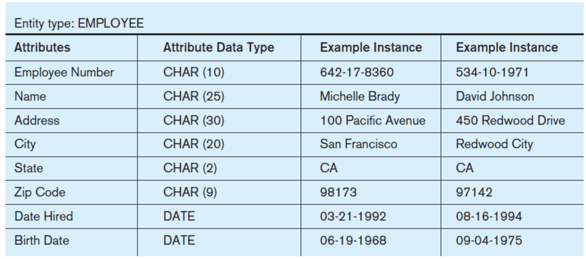

# ER model

ER model主要分為三個部分：

- Entity（個體）
  - Entity Type：可以是一的地點、人、物件、概念
  - Entity instance：例如台中、小明、小華（通常是table中的一列資料）

- Relationships（關係）
  - Entity Type
  - Entity instance：真正連接兩個Entity（個體）的link

- Attribute（屬性）：
個體和關係當中的屬性（通常是table中的一欄資料）

> 通常沒有更多欄位的就是Attribute，有更多延伸欄位的是Entity。

## 繪製ER-model的技巧

1. 先釐清有什麼BUSINESS RULES

例如：學校委託你整頓圖書館，你依照學校開出的需求
（business rules）重新規劃資料庫，以本校之圖書館為限，包含多個分館
- 需建立完整書目資訊，每一書目有多本藏書
- 書目資訊至少包含 Dublin Core 的前10個欄位
- 每一本藏書只會歸屬於一個分館
- 每一本藏書都有獨立的藏書號與藏書日期
- 需建立書目來源（出版商資料）
- 借書人為學生，每人可以借多本書，需建立借書紀錄

2. 訂出有什麼Entity

出版商、書目、書、學生

3. 訂出Entity之間的關係

- 一個出版商可能出多本書，一本書只有一個出版商。
- 一個書目對應多本書，一個書目對應多個出版商
- 一個書可以被多個學生借，一個學生可以借多本書

## Entity（實體）

實體又分為Entity Type（例如學生）和 Entity instance（例如小明、小華）

一個 Entity Type就是一個表格，裡面可能包含許多的Attribute，例如學生 ID、姓名、年齡...等。

1. 如何區別 Entity（實體）和Attribute ? 有多個欄位的就是一個 Entity（實體）

如果沒有更多衍生的欄位就只是Attribute。

2. 注意運算結果不要存成實體（除非是想加速運算）

運算結果像是從費用和產品計算出費用報告

### 命名建議

- 單數
- 看了就懂：如果只有一種學生，可以student就好，不用ntuStudent。
- 可讀性高
- 有固定命名規則
- 使用結果而非過程命名：例如訂購單，而非訂購

## RelationShip（關係）

關係又分成
- `Relationship Degreee`：表示Entity之間的關係，分為 Unary, Binary, Ternary。
例如：(1)在人的人的關係中，人可以跟人結婚。但因為只牽涉一個「人」的Entity，因此該關係就是Unary；(2)在課程和學生的關係中，因為牽涉到多個Entity，因此是屬於Binary的關係。
> 研究顯示，三元關係都可以被二元關係表示。
- `Relationship Cardinality`：表示Entity的屬性（Attribute）之間的關係，分為 one-to-one , one-to-many, many-to-many。
例如：(1)一個人只可以跟一個人結婚，因此兩個人是屬於one-to-one的關係。(2)一個人可以有多個課程，一個課程可以有多個人，因此課程和人可以是many-to-many的關係。

因此總共有9種關係。

> 以上關係要可以畫出來

## Attributes

一個Entity裡面會有各種屬性，例如ID、姓名、年齡，該資料可能是。
1. 識別屬性（Identifier Attributes）

Identifier是用來唯別的獨特欄位，Identifier可能有多種選擇，例如身分證、名字、地址、手機通常都很獨特，可以當成Identifier。但是因為名字、地址、手機可能都會改，因此身分證會是相對更好的選擇。其中，`Primiary Key`是資料表中唯一不會更改的「主鍵」。

### 如何挑選好的Key？

- 不會改
- 不是null

> 如果真的挑不到，就用流水號就好。

2. 必填/選填屬性（Required versus Optional Attributes）：必填/選填
3. 儲存屬性/衍生屬性 （Stored versus Derived Attributes）：衍生性屬性，例如年齡就是生日的衍生性屬性（但不推薦把可以算出來的資料儲存為衍生性屬性）
4. 單值/多值 （Single-Valued versus Multivalued Attribute）：例如一個員工擁有的技能，可能是多值的
5. 簡單屬性/複合屬性（Simple versus Composite Attribute）：例如地址可以分為，郵遞區號、鄉鎮市、區的子屬性。

> Attribute在命名的時候可以不用是course_id之類的，因為用 course.id自然就可以得到我們想要的值。

### 資料類型

VARCHAR2：多國語系，通常會存這種
CHAR：
BLOP：例如圖片
NUMBER
DATE
CLOB

### 資料設定

- 給預設值
- 值得範圍
- 是否允許無值、空值

