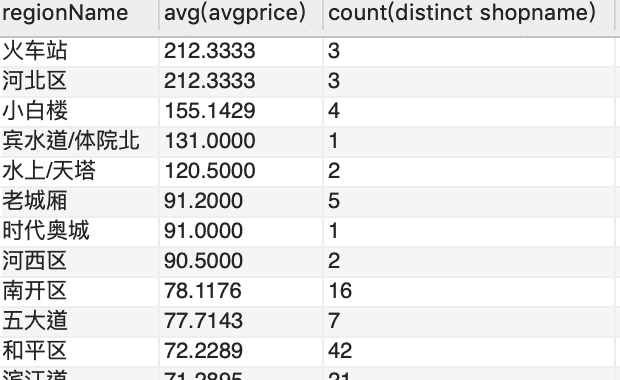
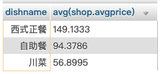
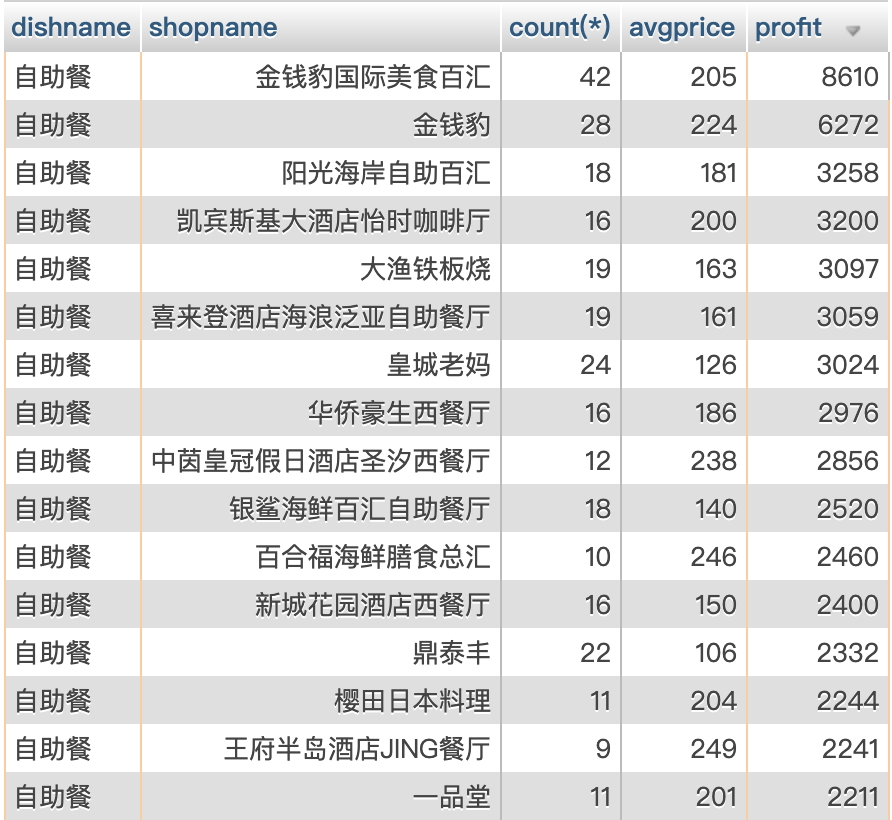
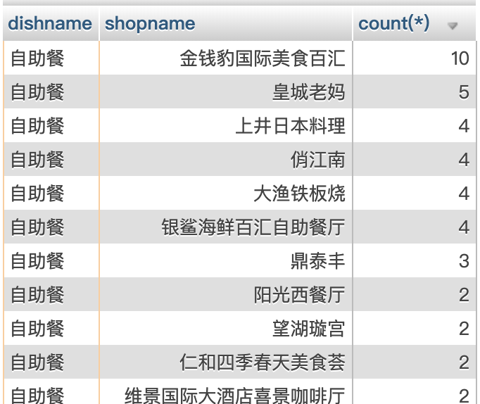

# 大中華地區餐飲市場進入策略分析 <br/> Greater China Catering Market Entry Strategy

## 專案介紹 Introduction

透過數據分析大中華地區所有餐廳、菜系、地區資料，並為台灣餐飲業者提供合適的市場進入（Market entry）之策略建議

Analyzed Greater China all restaurants data crawling from mainstream apps with SQL and delivered solutions to market entry.

>餐飲數據爬蟲於大眾點評網、新浪生活餐飲

## 專案目標 Goal and Objective

台灣餐飲品牌A預計在2020年進軍大陸市場，但還未決定產品，因此品牌A希望團隊可以提供一套市場進入的策略，內容包括：

- 大陸地區最有市場潛力的菜色是什麼？可以推出什麼菜系？
- 該菜系最有市場潛力的城市？
- 應該選擇該城市中哪個區域作為第一個進入市場？
- 合理的定價範圍？
- 開幕後可以邀請哪些網紅試吃？
- 在進入市場前，有哪些成功的該菜系品牌可以做案例研究？

## 執行摘要 Executive summary

1. 建議A品牌以`自助餐`作為推出的菜系，並以`天津市`的`河北地區`作為第一個進入市場，定價範圍在100-200內。因為
    - 相較於其他菜系，自助餐是大陸地區最具有市場規模與潛力的菜系
    - 相較其他市，天津市對於自助餐具有更高的市場需求，其中天津市的河北地區當地並沒有相關競爭者，因此可作為第一個進入市場。
    - 相較於全國自助餐平均價格100，河北地區擁有更高的飲食平均消費力200，因此定價範圍可以在100-200內。
2. 在行銷方面開業後邀請天津市飲食評論網紅`ttinnn`、`liuruichloé`、`yqqy66`..以幫助品牌營銷。
3. 在進入市場前，可以參考`陽光海岸自助百匯`和`皇城老媽`作為案例參考對象

## 專案結果 Analysis Results

### 1. 大陸地區最有市場潛力的菜系是什麼？

建議以「自助餐」（臺灣翻譯：吃到飽）作為進入的菜系，因為「自助餐的市場規模較大」
- 其中`市場規模(marketing size)`大約等於「需求量 X 平均單價」
    - 其中「需求量」，是以該菜系的「評論數量」（討論熱度）作為指標
    - 其中「平均單價」，直接以「該菜系的餐廳之平均客單價」作為直接計算


SQL指令：列出每個菜系的「評論數」

```sql
select dish.dishname,
count(*),
avg(shop.avgprice) * count(*) as profit,
avg(shop.avgprice) from 
shop.shopdish, 
shop.shopcomment,
shop.shop,shop.dish 
where dish.dishid = shopdish.dishid 
AND shopdish.shopid = shop.shopid 
AND shop.shopid = shopcomment.shopid 
group by dish.dishname 
order by  profit DESC
```
### 2.大陸地區哪個城市對於「自助餐」的需求最高？

建議以「天津」作為進入城市，因為相對於其他城市，天津城市對於自助餐的「需求量」最高
- 其中我們以「城市自助餐的評論數量」（討論熱度）作為需求量指標


- SQL指令:列出「自助餐」評論數最多的幾個城市
```sql
--- 需求最高的城市
select cityName,count(*) from 
shop.dish,
shop.shopdish, 
shop.shop,
shop.shopcity,
shop.city,
shop.shopcomment
where dish.dishid = shopdish.dishid AND 
shopdish.shopid = shop.shopid AND 
shopcity.shopid = shop.shopid AND 
shopcity.cityid = city.cityid AND
shopcomment.shopid = shop.shopid AND
dish.dishname = "自助餐"
group by cityName
order by count(*) DESC

```

### 3.應該進入「天津」哪個區域？

可以「河北區」作為進入的區域，因為
- 雖然天津市具有高需求量，但「河北區」沒有其他自助餐的競爭對手，因此具有競爭優勢
- 考量到人群的消費力，也可以發現「河北區」的人均消費力也最高
  -  我們以區域的「餐廳平均消費額」作為人均消費力的指標


SQL指令:列出天津市「有販售自助餐的所有區域」


```sql
select dishname, regionName, count(*) from 
shop.dish,
shop.shopdish, 
shop.shop,
shop.shopcity,
shop.city,
shop.shopregion,
shop.region
where 
dish.dishid = shopdish.dishid AND 
shopdish.shopid = shop.shopid AND 
shopcity.shopid = shop.shopid AND 
shopcity.cityid = city.cityid AND
shopregion.shopid = shop.shopid AND
shopregion.regionid = region.regionid  AND
dish.dishname = "自助餐" AND
city.cityname = "天津"
group by regionName
order by count(*) DESC
```


- SQL指令:列出天津市所有區域「餐廳平均消費額」



```sql
select regionName ,avg(avgprice), count(distinct shopname) from 
shop.dish,
shop.shopdish, 
shop.shop,
shop.shopcity,
shop.city,
shop.shopregion,
shop.region
where 
dish.dishid = shopdish.dishid AND 
shopdish.shopid = shop.shopid AND 
shopcity.shopid = shop.shopid AND 
shopcity.cityid = city.cityid AND
shopregion.shopid = shop.shopid AND
shopregion.regionid = region.regionid  AND
city.cityname = "天津"
group by regionName
order by avg(avgprice) desc
```


### 4. 河北「自助餐」的合理定價範圍？

可以考慮訂在102-260，因為全國的「自助餐」平均價格為93元，而河北地區物價比平均貴1.1~2.8倍
- 以當地的其他代表性菜系`西餐`與`川菜`作為benchmark，和全國平均對照，可發現河北地區物價比平均貴1.1~2.8倍，
    - 全國西餐平均149，河北地區西餐到164，大約為1.1倍
    - 全國川菜平均56，河北地區西餐可到160，大約為2.8倍


SQL指令：尋找河北地區其他的代表性菜系


```sql
select regionName ,dishname,avg(avgprice), count(distinct shopname) 
from shop.dish, shop.shopdish, shop.shop, shop.shopcity, shop.city, shop.shopregion, shop.region 
where dish.dishid = shopdish.dishid AND 
shopdish.shopid = shop.shopid AND 
shopcity.shopid = shop.shopid AND 
shopcity.cityid = city.cityid AND 
shopregion.shopid = shop.shopid AND 
shopregion.regionid = region.regionid AND 
city.cityname = "天津" AND 
region.regionName = "河北区" 
group by dishName 
order by avg(avgprice) Desc
```


SQL指令：尋找河北地區其他的代表性菜系在全國的平均價格

```sql
select dish.dishname, avg(shop.avgprice) 
from shop.shop, shop.dish, shop.shopdish 
where dish.dishid = shopdish.dishid AND 
shopdish.shopid = shop.shopid 
AND dish.dishname IN ("自助餐", "西式正餐", "川菜") 
group by dish.dishname o
rder by avg(shop.avgprice) DESC
```


### 5. 可以邀請哪些「天津」的美食評論網紅？

可以邀請ttinnn、liuruichloé、yqqy66、cute兔乖乖、Sharon_999、弱水三千327，因為他們是天津市評論數最多的人
- 其中弱水三千327的平均評分最高，可以優先邀請
- Sharon_999的平均評分最低，必須要小心邀請


- SQL：列出天津市評論數最多的人
```sql
select author, count(*),avg(shopcomment.Positivescore), review from
shop.shop,
shop.dish,
shop.shopdish,
shop.shopcomment,
shop.shopcity,
shop.city,
shop.shopregion,
shop.region
where dish.dishid = shopdish.dishid 
AND shopdish.shopid = shop.shopid 
AND shopcomment.shopid = shop.shopid 
AND shopcity.shopid = shop.shopid 
AND shopcity.cityid = city.cityid 
AND shopregion.shopid = shop.shopid 
AND shopregion.regionid = region.regionid 
AND city.cityname = "天津"
group by author
order by count(*) desc
```

- SQL：列出活躍所有吃自助餐很常評論的人
> 棄用，因為發現最多只有3人

```SQL
select author, count(*), review from
shop.shop,
shop.dish,
shop.shopdish,
shop.shopcomment
where dish.dishid = shopdish.dishid 
AND shopdish.shopid = shop.shopid 
AND shopcomment.shopid = shop.shopid 
AND dish.dishname = "自助餐"
group by author
order by count(*) desc
```

### 6. 在100-200價位有哪些成功的「自助餐」企業可以參考？

可以參考`陽光海岸自助百匯`和`皇城老媽`因為，兩者同屬於單價須在100-200內的自助餐品牌。其中
- `陽光海岸自助百匯`是`平均單價*評論數量`最高的自助餐店
- `皇城老媽`是數量最多的連鎖自助餐店




SQL:根據「單價*評論數量」列出大陸地區的自助餐店（單價須在100-200內）
```sql
select dish.dishname,shopname,count(*),shop.avgprice, count(*)*shop.avgprice as profit from 
shop.shopdish, 
shop.shopcomment,
shop.shop,shop.dish 
where dish.dishid = shopdish.dishid 
AND shopdish.shopid = shop.shopid 
AND shop.shopid = shopcomment.shopid 
AND dish.dishname = '自助餐'
AND shop.avgprice <=200 AND  shop.avgprice >=100
group by shopname
order by profit DESC
```



SQL:列出大陸地區「連鎖數量」最多的自助餐店（單價須在100-200內）
```sql
select dish.dishname,shopname,count(*) from 
shop.shopdish, 
shop.shop,
shop.dish 
where dish.dishid = shopdish.dishid 
AND shopdish.shopid = shop.shopid 
AND dish.dishname = '自助餐'
AND shop.avgprice <=200 AND  shop.avgprice >=100
group by shopname
order by count(*) DESC
```

