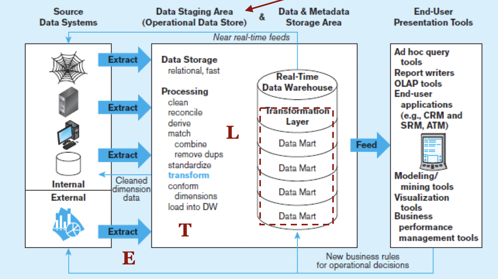
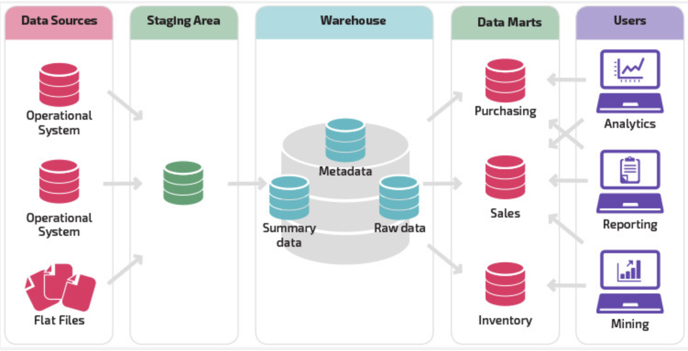

# 資料倉儲（Data Warehousing）

假設，統一超商的總經理跟分析師說「近三年的資料報告給我」，那假設這個分析很複雜，要掉很多的資料庫。這時候使用真的超商POS機的資料庫，那可能就會拖慢資料庫效能。

因此通常資訊系統會要有分流、分道的概念，通常會分為：

- `Operational System`（日常營運系統）：用來進行幫助即時交易，比如說便利商店的POS機資料庫。該系統盡量不要存舊的資料，並且要時常做資料卸載（Data Offload），設計重點是要注重效能、單位系統運算量、不斷線。
- `Informational System`（分析用系統）：用以讓高階主管進行決策用，會儲存許多很舊的資料，可以支援很複雜的查詢，並且可以支援批次查詢。通常這就叫做`資料倉儲（Data Warehousing）`

因此「資料倉儲」是一種專門「儲存歷史」的「整合式」資料庫，跟一般的資料庫通常會有以下特色

- subject-Oriented（圍繞特定主題）：有特定的主題，例如顧客、病人、學生、產品。
- Intergrated（整合）：要將不同來源的資料進行整合。EX：把同屬於顧客的資料整合在一起。
- Time-Variant（時間相關）：會把歷史資料留下來。EX:把之前的合約資料、購物資料都留下來。
- Non-updatable（不可更新）：唯獨，週期性更新。EX：之前的合約資料不可以再更改。

## 倉儲的過程

企業在進行資料倉儲的過程中，通常會經過：
1. Extract（輸出資料） ：把資料從日常營運系統輸出
2. Transform（轉換)：因為不同的日常營運系統的資料庫設計不同，因此需要利用資料清洗（Data cleansing）處理以下問題
    - Inconsistent key structures 不一致的PK（例如：Ａ用Student Name，B用Student ID當Key）
    - Synonyms 同義字問題（例如：Student No和Student ID都是學生證）
    - Free-form vs. structured fields 欄位切法不同（例如：A表格用姓＋名，B表格用姓名）
    - Inconsistent data values 資料值不一致
    - Missing data 缺值問題
3. load（載入資料庫）：將轉換好的資料庫，放進同一個資料倉儲資料庫。

### 常見架構

該架構的資料倉儲中分為不同資料庫，但是在界面上看起來是從同一個資料庫來的。

該架構把資料放在同一個資料倉儲的資料庫中，這樣只需要進行一次性連線。
### 三層架構模型

常見的架構是把資料庫分為：

1. 日常作業資料庫（Operational System）：即時營運資料儲存的地方，例如商店中的POS機資料會上傳到
2. 整合資料庫（Data Warehouse）：把即時營運資料定時的卸載到資料倉儲中，並且整合在一個資料庫中。
3. 部分的資料（Data Mart）：把資料倉儲的資料拿出來，讓各個部門方便分析。例如銷售部門有自己的銷售資料，然後銷售部的人自己去分析、做報告。

## 收集的資料類型

在資料倉儲時，會儲存一些更細微的資料，比如說Event Data以及Periodic data。

- Status data VS Event Data
  - Status data：只紀錄Before & After的資料
  - Event Data：會紀錄改變Status的事件是什麼（比如說：交易）
- Transient data VS Periodic data
  - Transient data：新增加的資料，會把舊的資料覆蓋掉。
  - Periodic data：不會直接把舊的資料覆蓋，而是使用時間戳記（timestamp）來新增一筆資料，去紀錄資料改變的狀況，但缺點是資料量會變多。如果是一個機密的系統，通常會把資料的操作過程記錄下來，之後可以用來做`資料鑑識`。

### 收集的資料特性

在資料倉儲時會允許加入描述性欄位，用空間換取時間，方便進行快速運算。比如說，通常在一般的資料庫中有記生日，就不要記年齡。但是在資料倉儲的時候，資料數據太多，可能有幾億、幾百萬筆，這時候就會允許加入衍生性資料（Derived Data）。

### 建設資料倉儲需要考量的因素

在建設資料倉儲的時候，必須要確定以下因素，因為他們跟`成本`息息相關

- `紀錄顆度`：確定要分析的最小資料單位。例如：紀錄超商資料時，最書寄到分店資料？還是連該店的哪一臺POS機資料都要紀錄？
- `更新的速度`：確定資料收集的時間。例如：資料是要每日更新？還是沒小時更新？如果每日更新，就無法做小時的分析，但如果以小時為更新，就會增加24倍的資料量。

### 預估資料倉儲成本 Size of fact table

因為會影響成本，因此可以透過`費米計算`，稍微估計資料量大小。比如說：
- 商店數量：1,000
- 產品數量：10,000
- 時間間隔：2年

1000 X 5000個active product X 24月 = 120,000,000
若每筆記錄有6個數字，每個數字是4bytes，原始資料就是2.88G。

### 設備購置

常見使用混合雲的結構
- 雲端資料庫：如果資料會忽大忽小，可以放在雲端，因為他是彈性的。雲服務商通常會有些不同方案，有些比較快，支援SSD，有些比較慢。
- 實體資料庫：如果資料大小可以被預計，買實體就會比較划算。

### 大數據

- Data Lake：所有資料就丟進去，要用在想辦法拖出來

### 資料格式

XML：標籤裡面存資料，缺點是標籤比資料多
JSON：現在業界最實用的格式
