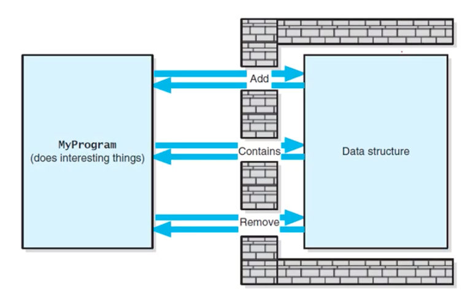

# 「資料結構」第一講：Data Abstraction and "bag" (1): OOA, OOD, and OOP


## 為什麼要有 Abstract data type(ADT)?

ADT `不是`一個程式提供的具體資料型態（例如：int、double），而是一個自行設計的抽象模組。它的作用是在program跟data structure中間建立道一道牆，讓program只能用規定的方式去存取data structure，而不會隨意的搗亂資料的狀態



> 在這個例子中，主程式只能用Add,Contain,Remove這些規定好的方式去存取資料

- complete：所有可以操作的動作，都要可以用函式提供出來
- minimal：不用提供的東西，就不要提供

## 如何設計ADT?

- Object-oriented(OO) 物件導向程式語言在設計時會經過三個階段OOA、OOD、OOP
1. OOA（Object-oriented Analysis）：瞭解問題設計，例如「找中位數」，什麼是中位數
2. OOD（Object-oriented Design）：描述解決方案，例如「如何找到中位數」
> 在1.2會寫一個Operation Contract（如下）
```js
// Sorts an array into ascending order  描述目標
// Precondition:an Array is an array of num intergers; 描述Precondition
//  1 <= num <= MAX_ARRAY, where MAX_ARRAY is a global constant that specifies the maximum size of anArray
// Postcondiction: anAttay[0] <= anArray[1] <= ...<= anArray[num-1]. num in unchanges.  描述Postcondiction
sort(AnArray, num)
```
3. OOD（Object-oriented Programming）：開始實作程式


# 題目練習：Bag

- Bag一種教學用的資料結構，實務上不使用

## Bag的條件

- Object沒有順序
- Object可以重複
- Object必須是一個統一的型態

(Behavior如下)

Adding/removing:
- 把Object加進去bag
- 移除特定的Object
- 可以移除所有的Object

Counting
- 算出所有的item
- 看bag當中是否是空的
- 算出特定的item數量

Query
- 搜索是否含特定的物件
- 看所有的物件
 
